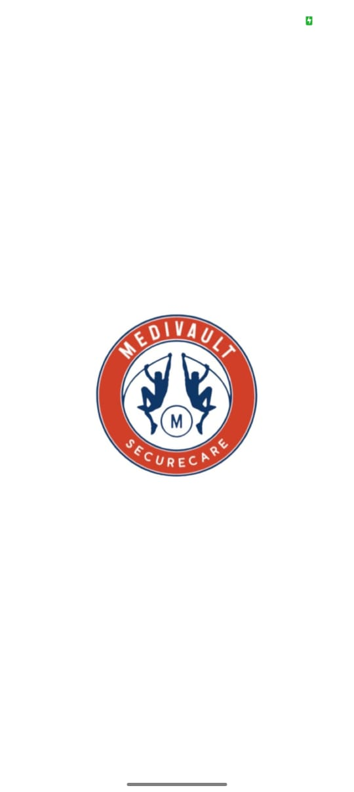
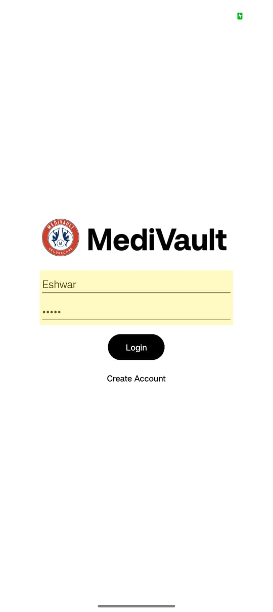
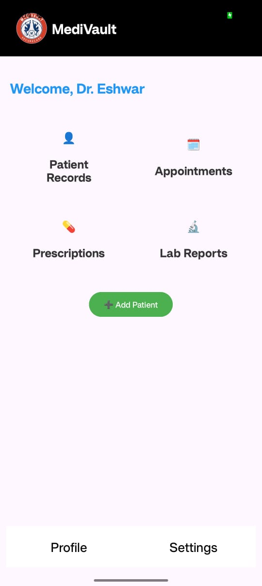
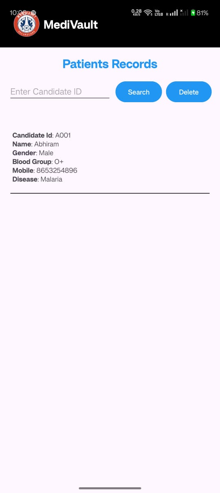

# MediVault - Android Medical Management App

**MediVault** is an intuitive and secure Android application tailored for healthcare professionals to manage day-to-day clinical and administrative tasks efficiently from a single platform.

## 🚀 Features

- **Splash Screen:** Stylish entry with app branding and transition.
- **Account Creation:** New users (doctors) can sign up securely with validation.
- **Login Page:** Secure login using username/email and password.
- **Dashboard (Home Screen):** Central hub with navigation to core modules.
- **Patient Records:** Add, view, search, and delete patient data using SQLite.
- **Appointments:** Schedule and notify patients via SMS with date/time pickers.
- **Prescriptions:** Write and send prescriptions via SMS.
- **Lab Reports:** Upload/view reports (PDFs/images) and send SMS notifications.
- **Profile Management:** Edit doctor info and update profile pictures.
- **Settings:** Toggle light/dark themes and secure logout functionality.
- **Database:** Local SQLite for persistent storage of patient data.

## 🛠️ Tech Stack

- **Language:** Kotlin
- **Database:** SQLite (via custom `DatabaseHelper.kt`)
- **UI Design:** XML layouts
- **Storage:** SharedPreferences (for sessions, settings, and profile data)
- **Communication:** SMS for appointment and prescription notifications

## 📂 Project Structure Highlights

- `MainActivity.kt`: Splash screen
- `CreateAccount.kt`, `LogInPage.kt`: Authentication
- `HomeScreen.kt`: Dashboard
- `PatientRecords.kt`, `AddPatient.kt`: Patient management
- `Appointments.kt`: Scheduling
- `Prescriptions.kt`: Medical records
- `LabReports.kt`: Upload lab results
- `Profile.kt`, `Settings.kt`: Customization and configuration

## 📱 Permissions Required

- Storage Access
- SMS Sending
- Internet Access

## 📸 App Screenshots

| Splash Screen | Login | Dashboard |
|---------------|-------|-----------|
|  |  |  |

| Patient Records | Appointments | Prescriptions |
|-----------------|--------------|---------------|
|  |  |  |

| Lab Reports | Profile | Settings |
|-------------|---------|----------|
|  |  |  |

## 📄 Conclusion

MediVault empowers doctors with a digital tool to manage patient records, appointments, prescriptions, and lab reports in one place. With local data storage, SMS integration, and a user-friendly interface, the app is a practical solution for modern medical practice.

---

**Developed by:**
- Pavanagundla Jayanth (Reg No: 12200751)
- Ponnu Jagadesh Reddy (Reg No: 12222949)
- Aelagonda Eshwar Teja (Reg No: 12214614)

Guided by: *Shruti Jairath*  
Lovely Professional University, Phagwara, Punjab

